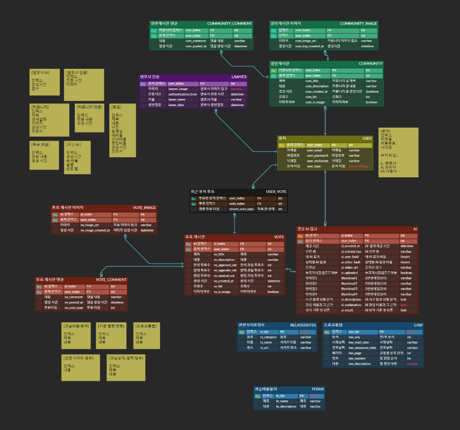

# White-Box - 교통사고 분쟁 해결을 위한 AI 사고판독 서비스

## 목차
### 1. [프로젝트 개요](#1-프로젝트-개요)
### 2. [기술 스택](#2-기술-스택)
### 3. [아키텍처 & ERD](#3-아키텍처--erd)
### 4. [서비스 기능 소개](#4-서비스-기능-소개)
### 5. [프로젝트 회고](#5-프로젝트-회고)

## 1. 프로젝트 개요
[White-Box](https://j11a104.p.ssafy.io/)는 교통사고 분쟁 해결을 위한 AI 사고판독 서비스를 제공하는 사이트입니다. 

###  📅 개발 기간
| 개발기간 | 2024.08.26 ~ 2024.10.11 (7주) |
|-|-|

###  👥 팀원 소개
| 팀원   | 역할        | 개발 내용                                                    |
|------|-----------|----------------------------------------------------------|
| 신우호 | 팀장, AI 리드    | MMAction2 SlowFast ResNet 50 모델을 이용하여 교통사고 블랙박스 영상을 124개의 교통사고 유형으로 분류 |
| 정호성 | FE 리드     | 프론트엔드 세팅, 메인페이지 구현, 유저관련 페이지 구현, 과실판단 및 투표재고 구현, 정보게시판 구현 |
| 민  호 | FE | Figma 이용 UI 구현, 커뮤니티 구현(투표, 댓글, rich text editor 등 구현) |
| 차재훈 | BE      | Spring boot와 FastAPI 간의 Reactive Streams 적용,게시판 REST API 구현과 미디어 파일 처리  |
| 송인범 | BE,AI,INFRA | object-detection model 개발, rag 모델 개발, 변호사 인증 로직 개발, 회원 기능 개발, 정보 게시판 개발, AI 통신 서버 개발|
| 김근욱 | INFRA | ec2, docker 기반 서버 구축, Jenkins 활용 파이프라인 구축 |

### 💡 기획 배경
다음과 같은 문제 상황들을 개선하고자 했습니다.

1. 연간 100만 건 이상의 교통사고 발생건수가 꾸준히 증가하는 추세를 보이고 있습니다.
2. 교통사고로 인한 분쟁 심의 건수가 매년 가파르게 늘어나고 있습니다.
3. 분쟁 심의 및 소송에 소요되는 시간이 길고, 절차가 복잡합니다.

### 💡 기대효과 및 차별점
1. 기대효과
    - 교통사고 과실비율을 산정하기 위해 소요되는 시간과 비용 절감
    - 보험사 및 법률 전문 기관의 업무 부담 완화
    - 교통사고 통계 자료로서 활용가능
2. 차별점
    - 어디에도 없던 새로운 서비스
    - 신속하고 편리하게 사고 과실을 확인할 수 있음
    - RAG기반으로 풍부하고 이해하기 쉬운 산정 근거 제공 및 중립적인 판단 제공

## 2. 기술 스택

  Infra
  

    
    
    
    
  

  BE & DB
  

     
    
    
    
  

  FE
  

    
    
    
    
  

  AI
  

    
    
    
  

## 3. 아키텍처 & ERD

## 4. 서비스 기능 소개
#### 1. AI
    1. RAG(Retrieval-Augmented Generation)
        - 대법원 판례 88000개를 크롤링
        - 교통사고 용어들을 기준으로 9000여개의 데이터 셋 구축
        - SBert기반으로 임베딩 파일 구축
        - Chroma DB 기반의 쿼리 탐색으로 유사 판례 제공
        - LangChain 기반의 파이프라인으로 LLM 질문 프롬프트 구축
        - 프롬프트 엔지니어링 기법으로 ReAcT 프레임워크 활용
    2. CasCade R-CNN
        - 순차적인 end - to - end 기반의 Object-Detection 학습
        - 프레임을 R-CNN 기반의 학습으로 라벨링 작업 수행
    3. SlowFast ResNet50
        - Bounding Box가 표시된 이미지들을 이용하여, 124개 교통사고 유형으로 분류
        - 각 유형별 사전에 정의된 사고장소, 사고장소 특징, 상대/블랙박스 차량 진행방향, 과실비율 제공
    4. DeepFace
        - 두 이미지를 verify 하는 알고리즘
        - threshold를 0.3으로 설정하여 두 이미지 간의 유사도 판별
     

#### 2. 투표게시판
    1. AI 판독 결과를 바탕으로 다른 사용자들의 투표를 받을 수 있는 게시판을 제공한다.
    2. 투표 게시판에는 AI 판독에 쓰인 비디오를 비롯해 추가로 제목과 설명, 이미지를 입력할 수 있다.
    3. 댓글에는 그 사용자가 댓글을 쓴 시점에 마지막으로 투표한 결과가 표시된다.
    4. ai 얼굴인식을 통해 인증받은 변호사는 인증 마크가 표시되어 댓글에 표시된다.

#### 3. 정보게시판
    1. 교통사고 관련 법 개정정보를 알 수 있다.
    2. 과실상계 및 절차에 대한 정보를 알 수 있다.
    3. 교통사고 관련 용어에 대한 정보를 알 수 있다.
    4. 교통사고 관련사이트에 대한 정보 및 링크를 통한 접근을 할 수 있다.

### 4. 유저 관련 기능 및 일반 게시판
    1. 유저는 로그인, 회원가입, 프로필 보기 등을 할 수 있다.
    2. 유저는 자신의 이름, 생년월일, 사진을 통해 변호사 인증을 할 수 있다.
    3. 유저는 프로필 페이지에서 자신의 사고내역, 자신이 참여한 투표, 자신이 쓴 일반 글을 확인할 수 있다.
    4. 유저는 글을 작성, 수정, 삭제, 타인의 글을 확인할 수 있다.

## 5. 프로젝트 회고
- **신우호**
  - 느낀 점: 처음으로 데이터의 전처리부터 모델 선정, 하이퍼파라미터 조정 등 AI 모델 학습을 해볼 수 있어서 정말 좋았습니다.
  - 아쉬운 점: 데이터 증강 기법을 적용하여 모델의 정확도를 높였으면 더 좋았을 것 같습니다.

- **정호성**
  - 느낀 점: React를 이용한 반응형 디자인과 스토어 관리를 통한 화면 구현, axios를 이용한 백엔드 서버와의 통신에 많은 경험치가 쌓인 것 같다. tailwindCSS를 사용해 보았고, 더 많은 프레임워크를 사용해 보고 싶다.
  - 아쉬운 점: 충분히 컴포넌트화 시킬 수 있던 것들을 컴포넌트로 만들지 못했던 코드가 일부 있었고, 코드가 길어지고 가독성이 떨어졌던 것 같다. 구현하기 전에 컴포넌트의 구조화에 대해 좀 더 신경쓰고 문서화를 할 필요가 있다고 느꼈다.

- **민호**
  - 느낀 점:
    1. 기술 사용: React 프론트엔드 라이브러리로 이번 프로젝트를 진행했습니다. 잘 사용할 수 있을지에 대한 고민이 컸지만, FE 리더의 도움과 지금까지 배운 프론트엔드 기술들, 그리고 개인적인 공부를 통해 제가 구현하고자 한 기능들 전부를 구현할 수 있었습니다
    2. 에러일지 작성: 7주간 30개의 에러일지를 작성하며 반복되는 에러를 줄일 수 있었습니다.
    3. 소통의 중요성: 백엔드 팀원들과의 소통을 통해 빠르게 문제를 공유하고 해결할 수 있었습니다.
  - 아쉬운 점: javaScript에 대한 지식이 부족하여 부가 기능을 구현할 때 시간을 많이 소모했습니다. 추가 공부에 대한 필요성을 느꼈습니다. 

- **차재훈**
  - 느낀 점: 처음으로 Spring Boot를 이용한 백엔드 개발을 진행, 어려운 점도 많았지만 많은 것을 배울 수 있었습니다.
  - 아쉬운 점: 클린 코드를 작성하지 못해, 본인이 작성한 코드도 이해하기 어려운 부분이 많았습니다. 다음 프로젝트에서는 컨벤션과 로직을 더 신경 써야 할 것 같습니다.

- **송인범**
  - 느낀 점: 백엔드 스프링 인가/인증을 구현해봐서 정말 행복하다. 최신 AI 기술에 대한 두려움이 있었는데 레퍼런스와 기존 지식을 잘 결합해 구현한 거 같다. 밤 늦게 고생한 시간이 많지만 문제 해결에 있어 논리적으로 접근해서 좋았다.
  - 아쉬운 점: 직접 코드를 많이 짜봐야하는데 chatGPT를 많이 활용해서 아쉽다. 그리고 성능 테스트에 있어 많이 해보지 못한것이 아쉽다. 그래도 jmeter는 해냈다!

- **김근욱**
  - 느낀 점: 인프라 정말 쉽지 않았다. 혼자 부딪혀 보려고했지만 어려운 부분이 많아 다른 사람들의 도움을 많이 받았다. 이러한 과정에서 배워가는 것은 많았던 것 같다.
  - 아쉬운 점: 초반에 인프라를 공부할 때 좀더 체계적으로 공부했으면 하는 아쉬움이 있다. 부분부분 기술들만 공부하다보니 하나의 플로우를 제대로 그리지 못했다. 앞으로 새로운 것을 배울 때는 초반 지식을 닦아둔 후 세부 기술로 들어가야겠다.
